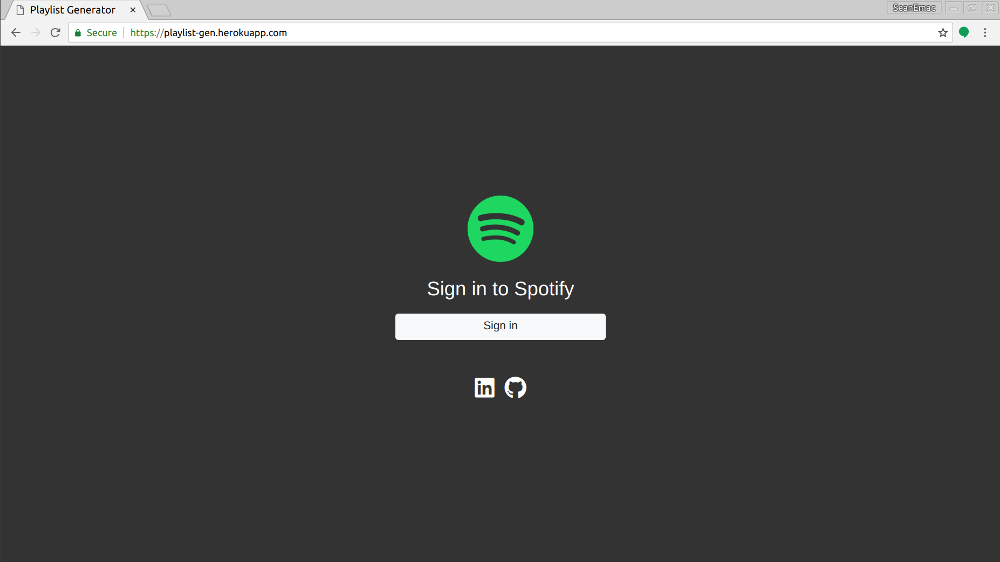
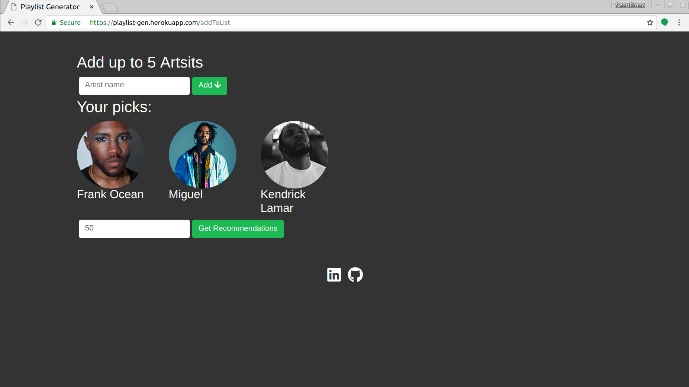
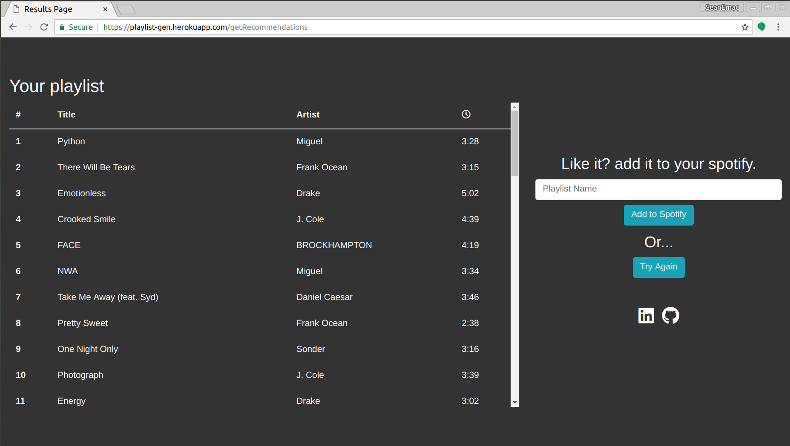

# Spotify playlist generator

## [Try it here](http://playlist-gen.herokuapp.com/)

I used Node.js with Axios to easily make async requests to spotify. The first step was to get an authentication token which you can include in subsequent request headers.

Once we have authentication out of the way we can make requests to spotify. Here a user can enter the name of an artist, we then search spotify for the artist info and profile picture. Using EJS we can display the results on the web page. Once the user is happy with the inputs we can get some recommendations.

We display the resulting playlist on a table and give the user the option to add it to their spotify library.

I learned a lot about interacting with API's during this project, in particular using Async await and Promises in Node.js. I also used Deployed the app to a heroku site which was a good learning experience. 

